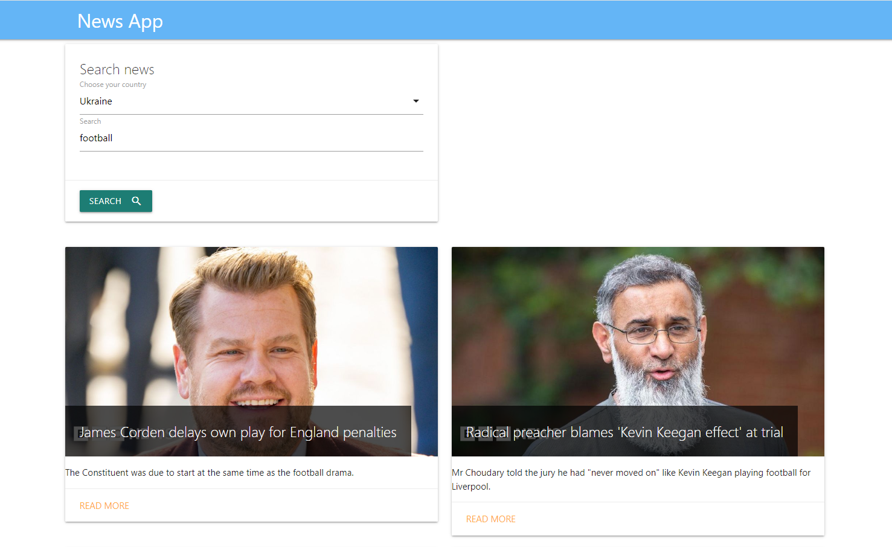

# Новинний додаток / News app

"News App" - це веб-додаток, що дозволяє користувачам переглядати новини за обраною країною та темою. Користувач може обрати одну з доступних країн: Україна (Ukraine) або Сполучене Королівство (United Kingdom).

Для створення інтерфейсу користувача використовувався фреймворк Materialize, який забезпечує сучасний і привабливий дизайн.
Для отримання даних про новини використовувався сервіс News API, який надає актуальні новини з різних джерел по всьому світу.